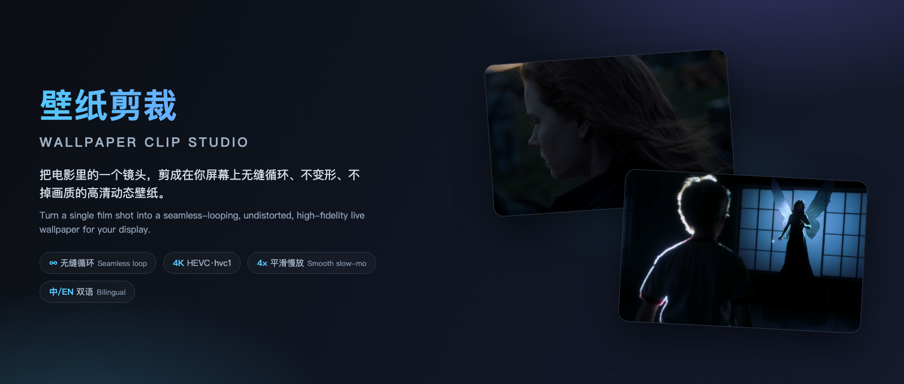
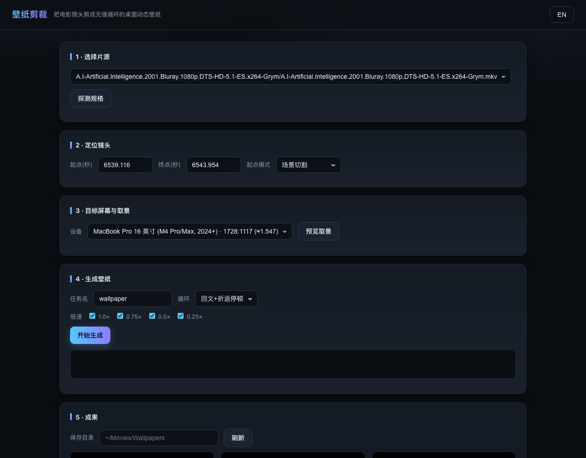
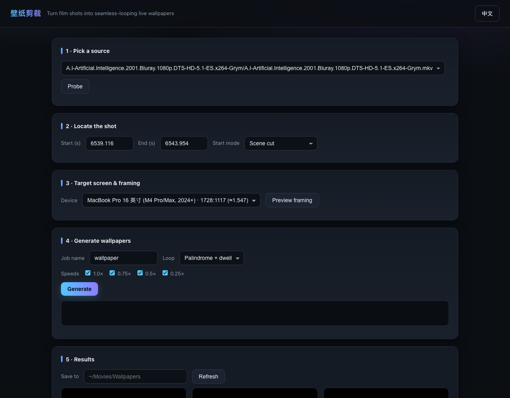
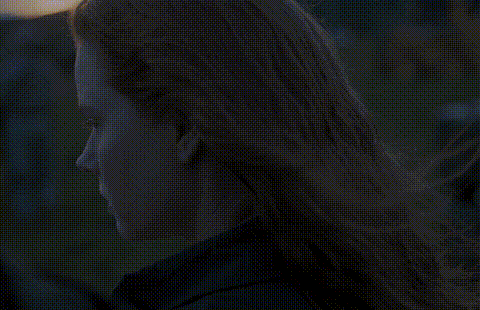
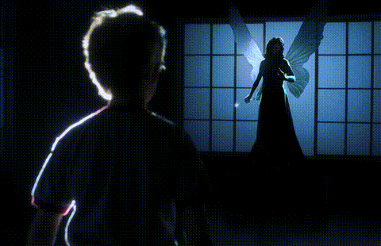
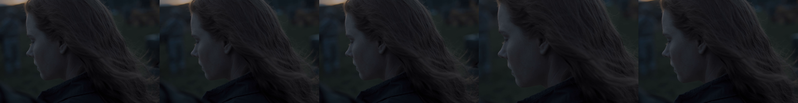
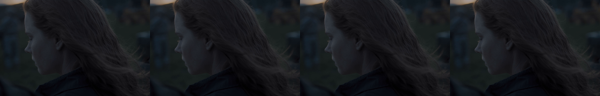

# 壁纸剪裁 · Wallpaper Clip Studio

> Turn a single film shot into a **seamless-looping, undistorted, high-fidelity** live wallpaper.
> 把电影里的一个镜头，剪成在你屏幕上**无缝循环、不变形、不掉画质**的动态壁纸。

[](LICENSE)
[](#)
[](requirements.txt)

---

## 效果展示 · Showcase

**UI (zh / en)** — preview → select → generate:

| 中文 | English |
|---|---|
|  |  |

**Loop effect (GIF)**:

| Arrival | A.I. |
|---|---|
|  |  |

---

## 功能 → 效果对照 · Features in pictures

### 1. Multiple crop strategies (same frame compared)
`center` neutral / `semantic` subject-aware / `energy` edge-energy centroid / `*_free` free-size / `fused_*` fusion-mean.
Below: the same frame cropped with five different strategies:



### 2. Four speeds (same shot)
1.0× / 0.75× / 0.5× / 0.25×, slow-motion via **motion-compensated interpolation** (MCI, no frame blending, no ghosting):



### 3. Seamless looping
- **Palindrome**：forward + reverse, last frame = first frame → pixel-identical loop point.
  正放+倒放，末帧=首帧，循环点像素级一致。
- **Palindrome + dwell** (default)：insert a brief hold at the reversal to soften the direction jump.
  在折返点插入短暂停顿，缓解"方向/节奏跳变"的弹跳感。
- **Crossfade**：tail-to-head blend transition.
  尾部与头部融合过渡。
- **Black/white frame trimming**：auto-trim fade-in/out black/white frames at both ends so the seam lands on visible content — no black flash.
  自动裁掉首尾的淡入淡出黑屏/白屏帧，让循环接缝落在可见内容上，杜绝黑闪/白闪。

### 4. Ratio-crop, never scale
Keep the full frame height, only crop width. **Never upscale or downscale** to maximize native quality. Device selection shows **ratio only**.
保留全部画面高度、只裁宽度，**绝不放大/缩小**，最大限度保留原生画质；设备选择只显示**比例**。

---

## 它解决什么问题 · What it solves

| Pain / 痛点 | Solution / 方案 |
|---|---|
| Screen ratio ≠ film ratio → stretching | Crop to target ratio: keep full height, trim width only, no scaling |
| 屏幕比例 ≠ 电影比例，拉伸变形 | 按目标屏幕比例裁剪，保全高、只裁宽、不缩放 |
| Loop jump (position / luma / chroma / black frame) | Palindrome loop + multi-dim seam QA (PSNR / luma diff / chroma diff / black frame check) |
| 循环首尾跳变（位置/明度/色彩/黑帧） | 回文循环 + 多维接缝质检（PSNR/亮度/色度/黑帧） |
| Choppy slow-mo, ghosting from frame blending | Motion-compensated interpolation (MCI), no frame blending |
| 慢放卡顿、传统插帧拖影 | 运动补偿插帧（MCI），禁用帧混合 |
| Palindrome reversal bounce | Dwell pause at reversal to ease the transition |
| 回文折返弹跳 | 折返停顿 dwell 缓动 |
| Letterbox misdetection in dark scenes | Film-wide consensus bars + luma-histogram true color range |
| 黑边/暗场景误判 | 全片黑边共识 + 像素直方图判定真实色彩范围 |
| Quality loss | Source-resolution crop + HEVC(hvc1) visually lossless + proper color passthrough |
| 画质损失 | 源分辨率裁剪 + HEVC(hvc1) 视觉无损 + 正确色彩透传 |
| Hard to pick framing | Preview → select → generate; center / semantic / energy / free / fusion cross-product |
| 取景难选 | 预览→勾选→生成；center/语义/energy/解锁/融合叉乘 |

## 快速开始 · Quick start

```bash
# Dependencies: ffmpeg/ffprobe (brew install ffmpeg), python3
# 依赖：ffmpeg/ffprobe（brew install ffmpeg）、python3
bash run.sh        # Launch Web workbench → http://127.0.0.1:8799  (no auto browser)
```

CLI (optional / 可选)：

```bash
python3 -m wpclip.cli process "sources/<film>.mkv" --name my_wall \
  --start 6539.1 --end 6543.9 --device mbp16-m4 --mode exact \
  --speeds 1.0,0.75,0.5,0.25 --outdir projects/my_wall/deliverables
```

Output is **MP4 (HEVC/hvc1, no audio, no subtitles)**, matching the target screen ratio.
Import into **Dynamic Wallpaper / Wallper / Vidwall** or any local video wallpaper app.
产物为 **MP4（HEVC/hvc1、无音轨、无字幕）**，比例与目标屏幕一致，可直接导入本地视频壁纸 App。

## 设备预设 · Devices

`mbp16-m4 / mbp14 / mba13 / mba15 / imac24 / studio27 / proxdr32 / uhd16x9 / hd16x9`,
or custom `WxH` (e.g. `3440x1440`). See [`wpclip/devices.py`](wpclip/devices.py).
或自定义 `宽x高`（如 `3440x1440`）。见 [`wpclip/devices.py`](wpclip/devices.py)。

## 取景策略说明 · Crop strategies

- **center**：Neutral, centered at the horizontal midpoint. Most stable, no assumptions.
  中性居中。最稳、无主观假设。
- **semantic**：Subject-aware horizontal position.
  语义主体水平位置。
- **energy**：Edge-energy centroid — gradient magnitude summed by column, weighted centroid of
  "where detail is most concentrated". Content-driven, reproducible.
  边缘能量质心——灰度帧梯度幅值按列求和取加权质心，即"细节最集中的水平位置"，内容驱动、可复现。
- **\*_free**：Free-size — take a tighter fixed-ratio window at a fraction of full height.
  解锁尺寸，按高度比例取更紧凑的固定比例构图窗。
- **fused_\***：Pairwise / full-average fusion of multiple crop boxes (x, y, w, h).
  把若干裁剪框 (x,y,w,h) 两两/全体平均的融合取景。

See [`docs/pipeline.md`](docs/pipeline.md) and [`docs/USAGE.md`](docs/USAGE.md).
详见 [`docs/pipeline.md`](docs/pipeline.md) 与 [`docs/USAGE.md`](docs/USAGE.md)。

## 许可 · License

Non-Commercial Source License 1.0. See [`LICENSE`](LICENSE).
Upstream components (FFmpeg, x265, etc.) fetched at runtime, under their own licenses.
非商用源码许可，见 [`LICENSE`](LICENSE)。上游组件（FFmpeg、x265 等）运行期获取，遵循各自许可。

*Unofficial tool; source films are copyrighted — process only content you are entitled to use.*
*非官方工具；源片版权归原作者所有，请仅处理你有权使用的内容。*
